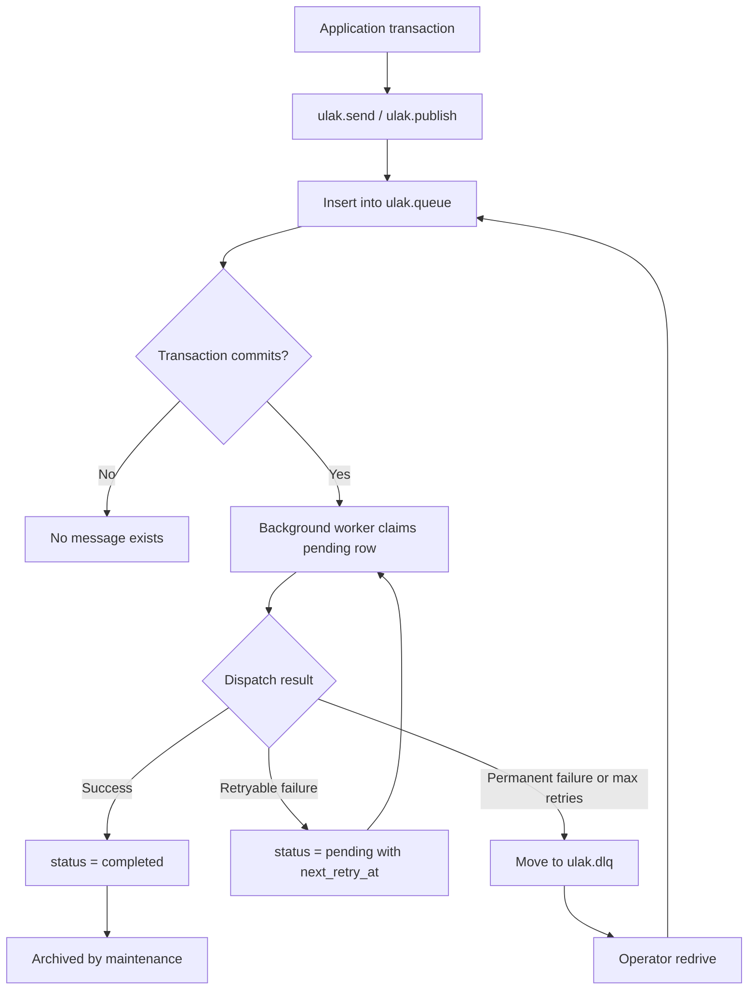
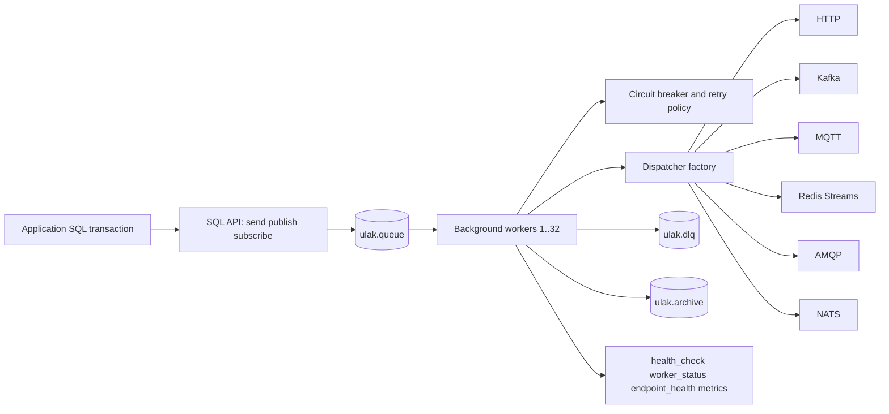

# ulak

[](https://github.com/zeybek/ulak/actions/workflows/ci.yml)
[](https://www.postgresql.org)
[](LICENSE.md)
[](https://github.com/zeybek/ulak/releases/latest)

`ulak` is a PostgreSQL extension for the transactional outbox pattern.

It solves the dual-write problem by inserting messages into `ulak.queue` **inside the same transaction** as your business data, then dispatching them asynchronously through PostgreSQL background workers. You get **exactly-once writes to the local queue** and **at-least-once delivery** to external systems.

`ulak` means "messenger". The point of the project is to keep enqueue atomic with your data, while moving retries, backoff, circuit breaking, DLQ handling, and redrive out of application code.

## Why ulak

- **Atomic enqueue**: `ulak.send()` and `ulak.publish()` write to the queue inside your transaction. If the transaction rolls back, the message never exists.
- **Database-native execution model**: background workers poll `ulak.queue` with `FOR UPDATE SKIP LOCKED` and dispatch without requiring a separate CDC stack.
- **Operational safety built in**: retry policy, stale-processing recovery, circuit breaker, DLQ, archive, health checks, and redrive are part of the engine.
- **Protocol adapters, one queue model**: HTTP is built in; Kafka, MQTT, Redis Streams, AMQP, and NATS are optional adapters behind the same lifecycle.

## Use ulak when

- PostgreSQL is your source of truth and you want outbox semantics close to the data.
- You need reliable webhook or broker delivery without rebuilding retry and DLQ logic in every service.
- You prefer database-native operations over an external CDC pipeline.

## Do not use ulak when

- You already operate a CDC stack such as Debezium and are satisfied with that model.
- Your main problem is large-scale event streaming infrastructure rather than transactional outbox delivery.
- You do not want background worker activity, queue state, and delivery policy managed inside PostgreSQL.

## How ulak compares

| Approach | Atomic enqueue with business transaction | Built-in retry / DLQ / circuit breaker | Runs inside PostgreSQL | Best fit |
|----------|-------------------------------------------|----------------------------------------|------------------------|----------|
| **ulak** | Yes | Yes | Yes | PostgreSQL-centric systems that want native outbox delivery |
| **App-level outbox** | Usually yes | Usually custom | No | Teams that prefer delivery logic in application services |
| **Debezium / CDC** | Yes | Broker or consumer dependent | No | Existing Kafka + CDC estates |
| **Direct broker publish** | No | Broker dependent | No | Fire-and-forget or eventually consistent integrations |

## Supported protocols

- **HTTP / HTTPS**: built in, always available
- **Kafka**: compile with `ENABLE_KAFKA=1`
- **MQTT**: compile with `ENABLE_MQTT=1`
- **Redis Streams**: compile with `ENABLE_REDIS=1`
- **AMQP**: compile with `ENABLE_AMQP=1`
- **NATS**: compile with `ENABLE_NATS=1`

All non-HTTP protocols depend on their client libraries at build time.

## 5-Minute HTTP Quick Start

`ulak` is a PostgreSQL background worker extension. It will not run unless PostgreSQL starts with:

```conf
shared_preload_libraries = 'ulak'
```

The shortest path is to start with HTTP only.

```bash
git clone https://github.com/zeybek/ulak.git
cd ulak

# Start PostgreSQL only
docker compose up -d postgres

# Build and install HTTP-only ulak
docker exec ulak-postgres-1 bash -c \
  "cd /src/ulak && make clean && make && make install"

# Preload ulak and point workers at the test database
docker exec ulak-postgres-1 psql -U postgres -c \
  "ALTER SYSTEM SET shared_preload_libraries = 'ulak';
   ALTER SYSTEM SET ulak.database = 'ulak_test';
   ALTER SYSTEM SET ulak.capture_response = 'on';"

docker restart ulak-postgres-1

# Create the extension
docker exec ulak-postgres-1 psql -U postgres -d ulak_test -c \
  "CREATE EXTENSION ulak;"
```

Create one endpoint and send one message:

```sql
SELECT ulak.create_endpoint(
  'httpbin',
  'http',
  '{"url": "https://httpbin.org/post", "method": "POST"}'::jsonb
);

BEGIN;
  SELECT ulak.send(
    'httpbin',
    '{"event": "order.created", "order_id": 123, "total": 99.99}'::jsonb
  );
COMMIT;
```

Check delivery state:

```sql
SELECT id, status, retry_count, completed_at, last_error
FROM ulak.queue
ORDER BY id DESC
LIMIT 1;

SELECT response
FROM ulak.queue
ORDER BY id DESC
LIMIT 1;

SELECT * FROM ulak.health_check();
SELECT * FROM ulak.get_worker_status();
```

If the target is reachable, the newest row should move from `pending` to `completed`. If delivery fails, `retry_count` and `last_error` show why, and the worker retries according to policy.

## Message lifecycle



## Architecture



## Delivery model and guarantees

- **Exactly-once write to the queue**: the enqueue happens inside the same transaction as your business data.
- **At-least-once delivery**: messages are only terminal after confirmed delivery or explicit failure handling.
- **Retryable failures stay in the queue**: the worker updates `retry_count`, schedules `next_retry_at`, and tries again.
- **Permanent failures move to the DLQ**: exhausted or permanent failures are archived into `ulak.dlq`.
- **Crash recovery is built in**: stale `processing` rows are reset back to `pending`.
- **Per-endpoint circuit breaker**: endpoints move through `closed`, `open`, and `half_open`.

What `ulak` does **not** claim is exactly-once delivery to remote systems. Remote consumers should still be idempotent.

## Core SQL API

### Queueing

```sql
SELECT ulak.send('endpoint_name', '{"event":"user.created"}'::jsonb);

SELECT ulak.send_with_options(
  'endpoint_name',
  '{"event":"user.created"}'::jsonb,
  5,
  NOW() + INTERVAL '10 minutes',
  'user-42-created',
  '550e8400-e29b-41d4-a716-446655440000'::uuid,
  NOW() + INTERVAL '1 hour',
  'user-42'
);

SELECT ulak.send_batch('endpoint_name', ARRAY[
  '{"id":1}'::jsonb,
  '{"id":2}'::jsonb
]);
```

### Endpoints

```sql
SELECT ulak.create_endpoint('orders-http', 'http',
  '{"url":"https://example.com/webhook","method":"POST"}'::jsonb);

SELECT * FROM ulak.get_endpoint_health();
```

### Pub/Sub

```sql
SELECT ulak.create_event_type('order.created', 'Order created');
SELECT ulak.subscribe('order.created', 'orders-http');
SELECT ulak.publish('order.created', '{"order_id":123}'::jsonb);
```

### Operations

```sql
SELECT * FROM ulak.health_check();
SELECT * FROM ulak.get_worker_status();
SELECT * FROM ulak.dlq_summary();
SELECT * FROM ulak.metrics();

SELECT ulak.redrive_message(42);
SELECT ulak.redrive_endpoint('orders-http');
SELECT ulak.redrive_all();

SELECT ulak.replay_message(100);
SELECT ulak.replay_range(
  1,
  date_trunc('month', now()) - interval '1 month',
  date_trunc('month', now())
);
```

## Reliability and operations

### Built-in behaviors

- **Retry policies**: configurable fixed, linear, or exponential backoff
- **Circuit breaker**: configurable threshold and cooldown per endpoint
- **Stale-processing recovery**: recovers messages left in `processing` after worker failure
- **Backpressure**: queue depth protection via `ulak.max_queue_size`
- **Archive management**: completed messages can be moved out of the hot queue into `ulak.archive`
- **DLQ retention and redrive**: failed messages stay inspectable and can be replayed into the queue
- **Event log**: internal lifecycle and operational events are recorded in `ulak.event_log`

### Operational checklist

- Set `shared_preload_libraries = 'ulak'`
- Set `ulak.database` to the database the workers should connect to
- Size `ulak.workers`, `ulak.poll_interval`, and `ulak.batch_size` for your workload
- Decide whether `ulak.capture_response` should be on in production
- Monitor `ulak.health_check()`, `ulak.get_worker_status()`, `ulak.get_endpoint_health()`, `ulak.dlq_summary()`, and `ulak.metrics()`
- Review `ulak.dlq_retention_days`, `ulak.archive_retention_months`, and `ulak.stale_recovery_timeout`

## Security and access model

`ulak` includes:

- **RBAC roles**: `ulak_admin`, `ulak_application`, `ulak_monitor`
- **HTTP SSRF protection**: internal URLs are blocked unless explicitly allowed
- **TLS / mTLS support**
- **HTTP auth helpers**: OAuth2 and AWS SigV4 validation paths are present in the repo
- **Webhook signing / CloudEvents support**

For the full protocol-specific security surface, see the wiki pages linked below.

## Installation

### Prerequisites

| Dependency | Required | Build flag |
|------------|----------|------------|
| PostgreSQL 14–18 | Yes | — |
| libcurl | Yes | — |
| librdkafka | Optional | `ENABLE_KAFKA=1` |
| libmosquitto | Optional | `ENABLE_MQTT=1` |
| hiredis | Optional | `ENABLE_REDIS=1` |
| librabbitmq | Optional | `ENABLE_AMQP=1` |
| libnats / cnats | Optional | `ENABLE_NATS=1` |

### Build from source

```bash
# HTTP only
make && make install

# All adapters
make ENABLE_KAFKA=1 ENABLE_MQTT=1 ENABLE_REDIS=1 ENABLE_AMQP=1 ENABLE_NATS=1 && make install
```

Then preload the extension and restart PostgreSQL:

```conf
shared_preload_libraries = 'ulak'
```

Create the extension in the target database:

```sql
CREATE EXTENSION ulak;
```

### Docker

```bash
# Default PostgreSQL major
docker compose up -d

# Specific PostgreSQL version
PG_MAJOR=15 docker compose up -d
```

The compose file includes PostgreSQL, Kafka, Redis, Mosquitto, RabbitMQ, and NATS for local development and e2e testing.

## Configuration essentials

All settings use the `ulak.` prefix.

| Parameter | Default | Purpose |
|-----------|---------|---------|
| `ulak.workers` | `4` | Number of background workers |
| `ulak.database` | unset | Database workers connect to |
| `ulak.poll_interval` | `500ms` | Queue polling interval |
| `ulak.batch_size` | `200` | Messages claimed per cycle |
| `ulak.default_max_retries` | `10` | Default retry budget |
| `ulak.retry_base_delay` | `10s` | Retry backoff base |
| `ulak.circuit_breaker_threshold` | `10` | Failures before opening the breaker |
| `ulak.circuit_breaker_cooldown` | `30s` | Cooldown before half-open probe |
| `ulak.capture_response` | `false` | Store protocol response payloads |
| `ulak.max_queue_size` | `1000000` | Backpressure limit |
| `ulak.dlq_retention_days` | `30` | DLQ retention |
| `ulak.archive_retention_months` | `6` | Archive retention |

See the [Configuration Reference](https://github.com/zeybek/ulak/wiki/Configuration-Reference) for the full GUC surface.

## Testing

The repository includes:

- **TAP tests** in [`t/`](/Users/ahmet/Code/ulak/t:1) for worker startup, reload, and stale recovery
- **Regression tests** in [`tests/regress`](/Users/ahmet/Code/ulak/tests/regress:1)
- **Isolation tests** in [`tests/isolation`](/Users/ahmet/Code/ulak/tests/isolation:1)
- **End-to-end protocol tests** in [`tests/e2e`](/Users/ahmet/Code/ulak/tests/e2e:1)

Run the core regression suite:

```bash
docker exec ulak-postgres-1 bash -c \
  "cd /src/ulak && make installcheck"
```

For local code quality:

```bash
make tools-install
make tools-versions
make format
make lint
make hooks-install
make hooks-run
```

## Documentation

Full documentation lives in the **[Wiki](https://github.com/zeybek/ulak/wiki)**.

| Category | Pages |
|----------|-------|
| Getting Started | [Quick Start](https://github.com/zeybek/ulak/wiki/Getting-Started) |
| Architecture | [System Architecture](https://github.com/zeybek/ulak/wiki/Architecture) |
| Reliability | [Reliability](https://github.com/zeybek/ulak/wiki/Reliability) |
| Monitoring | [Monitoring](https://github.com/zeybek/ulak/wiki/Monitoring) |
| Security | [Security](https://github.com/zeybek/ulak/wiki/Security) |
| Protocols | [HTTP](https://github.com/zeybek/ulak/wiki/Protocol-HTTP) · [Kafka](https://github.com/zeybek/ulak/wiki/Protocol-Kafka) · [MQTT](https://github.com/zeybek/ulak/wiki/Protocol-MQTT) · [Redis](https://github.com/zeybek/ulak/wiki/Protocol-Redis) · [AMQP](https://github.com/zeybek/ulak/wiki/Protocol-AMQP) · [NATS](https://github.com/zeybek/ulak/wiki/Protocol-NATS) |
| API Reference | [SQL API](https://github.com/zeybek/ulak/wiki/SQL-API-Reference) · [Configuration](https://github.com/zeybek/ulak/wiki/Configuration-Reference) |

## License

`ulak` is licensed under the [Apache License 2.0](LICENSE.md).
